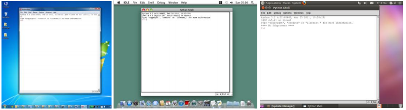

Capítulo 1 - instalando Python e Pygame	3

Se seu sistema operacional é Ubuntu ou Linux,inicie o IDLE abrindo uma janela do terminal e digite "idle3" e pressione Enter.Você também pode clicar em aplicações no topo da tela e selecionar Programação,e depois IDLE 3.

A janela que aparecer quando você executar o IDLE é chamada de interactive shell. Um shell é um programa que permite que você digite instruções em seu computador.O shell do Python  permite que você digite instruções em Python,e o shell envia essas instruções para o interpretador do Python executar.

#### Instalando o Pygame

O Pygame não acompanha o Python.Como Python, o Pygame está disponível gratuitamente.Você tem que fazer o download e instalar o Pygame,o que é muito fácil como fazer o download do interpretador Python.Em um navegador, vá para a URL http://pygame.org e clique no link de  "Downloads" no lado esquerdo do web site.Esse livro assume que você possui o sistema operacional Windows, mas o Pygame funciona igualmente para qualquer sistema operacional.Você precisa fazer o download do instalador do Pygame para o seu sistema operacional e para a versão do Python que você possui instalado.

Não faça o download do "código fonte" do Pygame,ao invés disso faça o download do Pygame"binary" para seu sistema operacional.Para Windows,faça o download do arquivo pygame-1.9.1.win32-py3.2.msi (Esse é o Pygame para Python 3.2 no Windows).Se você instalou uma versão diferente do Python (como a versão 2.7 ou 2.6) realize o download do arquivo .msi para sua versão do Python).A vesão atual do Pygame no momento em que esse livro foi escrito é a versão 1.9.1. Se você ver uma versão mais recente no website, faça o download e instale a versão mais recente.

Para Mac OS X, faça o download do arquivo .zip ou .dmg para a versão do Python que você possui e execute.

Para Linux, abra um terminal e execute "sudo apt-get install python-pygame".

No Windows, dê um duplo-clique no arquivo baixado para instalar o Pygame.Para verificar se o Pygame foi instalado corretamente,digite o seguinte no interactive shell:

`>>> import pygame`
