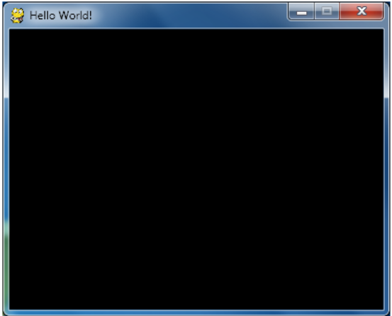

18 http://inventwithpython.com/pygame

(A imagem acima é um desenho de um unicórnio rosa invisível. )

#### Objetos pygame.Color

Você precisa saber como representar uma cor, porque as funções de desenho do Pygame precisam de uma maneira de saber que cor vc quer desenhar.Uma tupla
de três ou quatro inteiros é uma maneira.A outra maneira é usando o objeto `pygame.Color()`.Você pode criar objetos Color chamando a função construtora
`pygame.Color()` e passando três ou quatro inteiros.Você pode guardar esse objeto Color em variáveis do mesmo jeito que você guarda tuplas em variáveis.
Tente digitar o seguinte código no shell interativo:

	>>> import pygame
	>>> pygame.Color(255, 0, 0)
	(255, 0, 0, 255)
	>>> myColor = pygame.Color(255, 0, 0, 128)
	>>> myColor == (255, 0, 0, 128)
	True
	>>>

Qualquer função de desenho do pygame (que nós iremos aprender em breve) que possui um paramêtro de cor pode ter uma tupla de cor ou um objeto Color.
Mesmo que eles possuam tipos diferentes, um objeto Color é igual a uma tupla de quatro inteiros se elas representam a mesma cor (igual como 42 == 42.0
irá retornar True).

Agora que você sabe como representar cores( com um objeto pygame.Color ou uma tupla de três ou quatro inteiros para vermelho, verde, azul, e opicionalmente
alpha) e coordenadas (  com tuplas de dois inteiros para X e Y), vamos aprender como funcionam objetos pygame.Rect, assim nós podemos começar a usar
as funções de desenho do Pygame.

#### Objetos Rect

O Pygame possui duas maneiras de representar áreas retangulares (do mesmo jeito que existem duas maneira de representar cores).O primeiro é uma tupla
de quatro inteiros:

1. A coordenada X no topo do canto esquerdo.

> Mande questões por E-mail para o autor : al@inventwithpython.com
