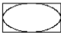

Capítulo 2 - Noções básicas de Pygame 23

* pygame.draw.line(surface, color, start_point, end_point, width) - Essa função desenha uma linha entre os paramêtros `start_point` e `end_point`.

* pygame.draw.lines(surface, color, closed, pointlist, width) -Essa função desenha uma série de linhas de um ponto até o próximo, parecido com `pygame.draw.polygon()`. A única diferença é que se você passar `False` para o paramêtro `closed` não haverá uma linha entre o primeiro e o último ponto(fechando ele), se você passar `True` então essa linha existirá.

* pygame.draw.ellipse(surface, color, bounding_rectangle, width)- Essa função desenha uma elipse (como um círculo achatado ou esticado).Essa função possui todos aqueles paramêtros, mas para poder informar a função a largura e onde a elipse será desenhada, você precisa especificar o retângulo delimitador da elipse. Um retângulo delimitador é o menor retângulo que pode ser desenhado em um shape.Aqui está um exemplo de uma elipse e seu retângulo delimitador.

O paramêtro bounding_rectangle(retângulo delimitador) pode ser um objeto pygame.Rect ou uma tupla de quatro inteiros.Perceba que você não específica o ponto do centro para a elipse como você faz para a função `pygame.draw.circle()`.

* pygame.draw.rect(surfacem color, rectangle_tuple, width) Essa função desenha uma retângulo.O rectangle_tuple pode ser uma tupla de quatro inteiros(para as coordenadas XY e para o canto superior esquerdo, e para a largura e altura) ou um objeto pygame.Rect.Se a retangle_tuple possui o mesmo tamanho para a largura e a altura, um quadrado irá ser desenhado.

#### Objetos pygame.PixelArray

Infelizmente, não existe uma função única que você possa chamar para colocar uma cor em um pixel(a não ser que você chame pygame.draw.line() com o mesmo ponto de inicio e de fim).O Pygame precisa executar código por trás dos panos antes e depois desenhar em um objeto Surface.Se ele tivesse que fazer isso para cada pixel, seu programa seria lento(pelos meus testes, desenhar pixels dessa forma é de duas a três vezes mais lento).

Ao invés disso, você deve criar um objeto pygame.PixelArray( nós chamamos de objetos PyxelArray) em um objeto Surface e então colocar os pixels individualmente.Criar um objeto PixelArray em um objeto Surface irá bloquear o objeto Surface.Enquanto um objeto Surface está bloqueado, as funções de desenho.
