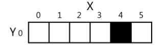
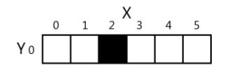

Capítulo 2 - Noções básicas de Pygame 25

Se você mudar a janela para que o pixel 3,0 for preto e o pixel 4,0 for branco, então ficará desse jeito.

A impressão que o jogador tem é que o pixel moveu para a esquerda.Se você redesenhar a janela para que o ponto 2,0 seja preto, parecerá que o pixel preto está se movendo.

Pode parecer que o pixel preto está se movendo, mas é apenas ilusão de ótica.O computador está apenas mostrando três imagens diferentes e cada uma possui um pixel preto.Considere as três seguintes imagens que aparecem na tela rapidamente:

Para o jogador, a impressão é que o gato está se movendo em direção ao esquilo.Mas para o computador, é apenas um monte de pixels.O truque para fazer animações incríveis é fazer seu programa desenhar uma imagem na tela, esperar um segundo e depois desenhar a mesma imagem levemente diferente.

Aqui está um exemplo de um programa que faz uma simples animação.Digite esse código no editor de arquivos `IDLE`  e salve como `catanimation.py`.Também será necessário que você faça o download da imagem em http://invpy.com/cat.png. Esse código está disponível em http://invpy.com/catanimation.py.
